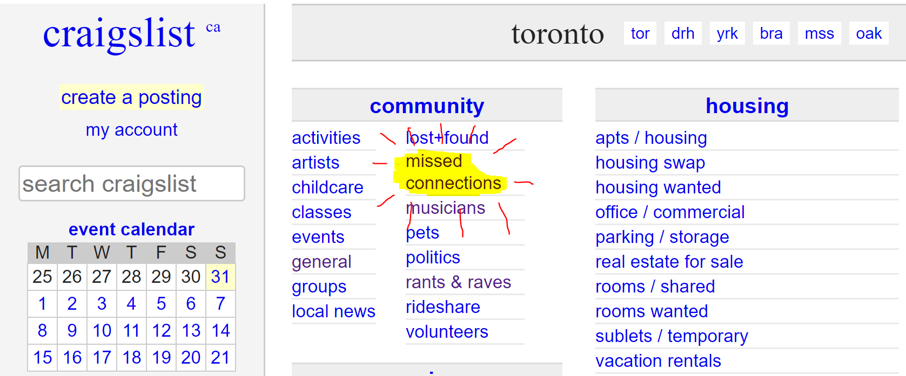

I've been looking to learn a bit more Python. In a mix of inspiration from an [old hackathon project](https://devpost.com/software/personalit-tweet) and the [Congratulations Podcast](https://www.congratulationspod.com/) - lets generate some fake craigslist posts with Python.

A [Markov Chain](https://en.wikipedia.org/wiki/Markov_chain), simply, is a model of probabilities for transitioning between states. It doesn't generate any 'new' insights, it just strictly bases its conclusions on the data provided to it. We're going to use one to make a crude natural language model, with the inputs being a feed of Craigslist posts that we'll scrape with Python. _Spoiler: this makes it funny._

How can we use it for language? Well - language isn't random. When we say a word, grammar and language often dictate for another word to follow. As an example, given a Mad-lib of "My name ... ", the next word after _name_ - most of the time - is, well, _is._ With enough sentences fed into a Markov Chain, it can quickly 'learn' general sentence structure, such as:

"I like ...", "I am ...", "I was ... then ...", and so on.

As for the gaps - that's where the material fed to the Markov chain starts filling in like a Mad-Lib. With Craigslist posts, that makes it... interesting.

To make the 'flow' of generated seem natural, we're going to make models for each sentence. These posts tend to be 4-5 sentences in length, starting with an introduction and gradually moving through their, uh, story. Funny enough, it actually works. Below, we get into the code.

The results were, uhhh, interesting. Simply, I have a [Github Repo](https://github.com/andrewlitt/Markovs-Craigslist) for the code, and shall leave execution as an exercise left to the reader.

Here's the libraries we're going to use:
* [Requests](http://docs.python-requests.org/en/master/)
* [BeautifulSoup](https://www.crummy.com/software/BeautifulSoup/bs4/doc/)
* [Markovify](https://github.com/jsvine/markovify)
* [Regex](https://docs.python.org/3/library/re.html)
* [Natural Language Toolkit](https://www.nltk.org/)

Here's the code, with comments:

```python
  import requests
  from bs4 import BeautifulSoup
  import markovify
  import re
  from nltk import tokenize

  # Script parameters
  cityname = 'toronto' # must match the craigslist format of 'cityname.craigslist.org'
  numSentences = 4     # number of sentences for the markov model to print!

  # Figure out how many pages there are
  r = requests.get('https://'+cityname+'.craigslist.org/search/mis')
  content = BeautifulSoup(r.content,'html.parser')
  TotalCount = int(content.find(class_='totalcount').string)
  numPages = TotalCount//120+1;

  # Initialize Markov chain models using Markovify. Using silly dummy sentences to start.
  titleModel = markovify.Text("Looking for a guy named John Doe")
  locationModel = markovify.Text("Main st.")
  textModel = markovify.Text("Met John the other day, have you seen him?")
  sentenceModels = []

  # For all the pages of missed connections
  for page in range(numPages):

    # Get the post list page, parse it with Beautifulsoup
    url = 'https://'+cityname+'.craigslist.org/search/mis?s=' + str(120*page)
    r = requests.get(url)
    content = BeautifulSoup(r.content,'html.parser')

    # For each post link in the list
    for postNum, post in enumerate(content.find_all('a',class_='result-title')):

        # Get the actual post
        url = post.get('href')
        r = requests.get(url)
        postContent = BeautifulSoup(r.content,'html.parser')
        postMeta = postContent.find(class_='postingtitletext')

        # If the post exists (Sometimes the link leads to a post that has been removed)
        if postMeta:
            postTitle = postMeta.find(id ='titletextonly').string
            postLocation = postMeta.small
            postText = postContent.find(id='postingbody')
            postText = postText.div.next_sibling.string
            postText = re.sub('[|]|:|-|;|"|(\(|\))|[\.][\.][\.]|[\']','',postText)
            postText = tokenize.sent_tokenize(postText)
            postTitle = re.sub('[|]|:|-|;|"|(\(|\))|[\.][\.][\.]|[\']','',postTitle)
            title =  markovify.Text(postTitle)
            titleModel = markovify.combine(models=[titleModel, title])

            if len(postText) > len(sentenceModels):
                while len(postText) > len(sentenceModels):
                    sentenceModels.append(markovify.Text('I'))

            for i, sentence in enumerate(postText):
                text = markovify.Text(sentence)
                sentenceModels[i] = markovify.combine(models=[sentenceModels[i], text])
            print('Processed Post ' + str(postNum+1+120*page) +'/'+ str(TotalCount-1)+' - ' + postTitle)

  # Generate Sentences from the Model
  print('\nMARKOV GENERATED\n')
  print(titleModel.make_sentence(tries = 100))
  print('\n')
  for i in range(numSentences):
    s = sentenceModels[i].make_sentence(tries = 100)
    if(s != 'None'):
        print(s)

```
