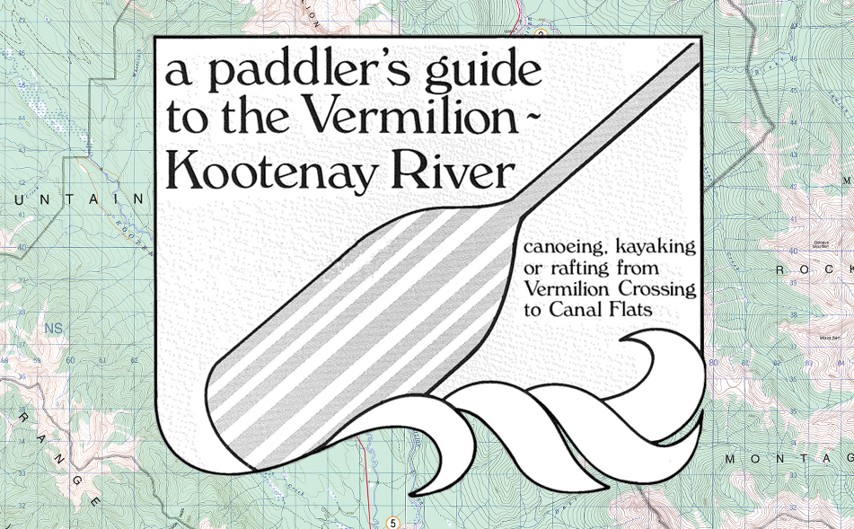

_This page is a work in progress_

We're heading west!

## Itinerary

Kicking off the trip on Canada Day weekend, The Guys (members of the trip, herein described as "The Guys") will set out to see 140km of the icy blue Kootenay River. 

1. Calgary to McLeod Meadows (30th)
2. McLeod Meadows and Back Again (1st, 38km)
3. McLeod Meadows to Cross River Confluence (2nd, 22km)
4. Cross River to ?? (3rd)
5. ?? to ?? (4th)
6. ?? to Gibraltar Rock (?) (5th)
7. Gibraltar Rock (?) to Canal Flats, Return to Cowtown (6th, 30km)

Upon our return, Calgary will on the verge of Stampede. 

## The River

For our <a href="https://alitt.ca/blog/coulonge/" target="_blank">last trip</a>, The Guys knew it well - while it was our first time doing our own logistics, many had run the Coulonge River in a past life. This time, less so. Most of us have never been to the interior without snow. We've gotta read up.

- <a href="http://parkscanadahistory.com/publications/kootenay/vermilion-kootenay-paddler-guide.pdf" target="_blank">A Paddler's Guide to the Vermilion-Kootenay River</a> is an undated publication from Parks Canada and British Columbia Ministry of Forests. This gem details every bend, every set, and all the sights to see along the way. This is our holy bible, and this write-up is mostly plagarism.
- <a href="https://paddlingmaps.com/trip/British%20Columbia/154-mcleod-meadows-to-canal-flats" target="_blank">PaddlingMaps: McLeod Meadows to Canal Flats</a> is a great assist for suggesting campsites, noting features, and generally helping plan how we'll chunk this thing up.

## Gearing Up

To stay afloat, <a href="https://www.rockymountainpaddling.com/" target="_blank">Rocky Mountain Paddling Centre</a> in Calgary's west end has been our saviour. We've rented 5 boats and a trailer, including other gear essentails: paddles, PFD's, throwbags, bailers, and whistles. Mostly 17' Nova Craft Prospectors, these bad boys will be fully loaded with airbags to keep us afloat on rogue ducky style sets.

For remaining gear we'll be looking to <a href="https://outdoor-centre.ucalgary.ca/gear-rentals" target="_blank">UofC's Outdoor Centre</a>: barrels, packs, tarps, tents, and whatever campsite gear The Guys don't own themselves. 

A detailed packing list will be thrown together in a Google Drive soon™.

## The Drop

_More to come_

## The Trip

_More to come_

## The Return

From our end at Canal Flats, we've booked a shuttle from <a href="https://www.rentfarout.com/" target="_blank">Far Out Gear Rentals</a> to take us back to our cars at Vermilion Crossing. Should take roughly an hour a half. From there, we'll hop in and spend another two hours driving back to Cowtown. Then it's Stampede.