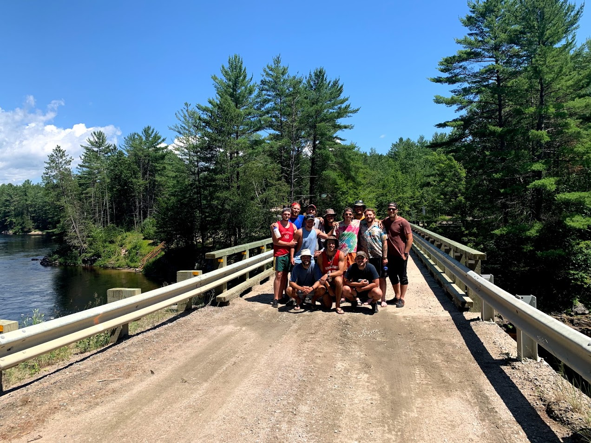

We're planning a trip. It's gonna take 10 days. This is how we're gonna do it.

## Itinerary

Declaring day 1 to begin on a Friday after work, it's possible for the trip to be done on just one week of vacation. It goes a little like this:

1. Toronto to Esprit _(A Friday)_
2. Esprit to Lac Pomponne
3. Lac Pomponne to Chute Perley
4. Chute Perley to Riviere de la Corneille
5. Riviere de la Corneille to Chute du Diable
6. Chute du Diable to Rapides Enrages
7. Rapides Enrages to Chute a L'ours
8. Chute a L'ours to Esprit
9. Whitewater rafting on the Ottawa River
10. Esprit to Toronto _(The following Sunday)_

And that's it.

Oh - yeah, a few more details below.

---
## The River

The Coulonge is a 217 kilometer long river that feeds into the Ottawa River, where it merges in about an hour northwest of the city of Ottawa. In that span it endures a 260 meter elevation drop, making it a popular river for whitewater canoeing. It's a great intro for new paddlers - a novice could make it through without capsizing - paired with some amazing campsites along the way. It's often travelled similar to the Dumoine or the Noire, rivers that run parallel to the Coulonge and share the same watershed. Alright - that's enough quoting Wikipedia.

## Getting There

Luckily, where the Coulonge river merges into the Ottawa you'll find [Esprit Whitewater](https://whitewater.ca), a rafting company ranked as one of the best in the world. Nice. They're huge in the whole plan, as they'll be our parking, accommodation, outfitters, chauffeurs, drinking buddies, and guides through the various parts of this trip, respectively. They're based in Fort-Coulonge - about 115km northwest of Ottawa.

So - leaving on a Friday night, The Guys (members of the trip, herein described as "The Guys"), will promptly hop in readied vehicles to rip out to the Esprit lodge. Here's what we'll be able to pack in the cars:
* Personal packs
* Tents
* Paddles (Flatwater/whitewater)
* Dry & fresh food
* Camp Kitchen
* Maps & Safety Gear
* Beer
* Barrels
* The Guys

More or less.

Now let's drive.

<iframe src="https://www.google.com/maps/embed?pb=!1m28!1m12!1m3!1d1218217.0838277726!2d-78.98940356800934!3d44.831414789847784!2m3!1f0!2f0!3f0!3m2!1i1024!2i768!4f13.1!4m13!3e0!4m5!1s0x89d4cb90d7c63ba5%3A0x323555502ab4c477!2sToronto%2C%20ON!3m2!1d43.653226!2d-79.3831843!4m5!1s0x4cd1170bf058721b%3A0xbee35461c029975e!2sEsprit%20Rafting%20Adventures%2C%20Chemin%20Esprit%2C%20Mansfield-et-Pontefract%2C%20QC!3m2!1d45.8782558!2d-76.7955893!5e0!3m2!1sen!2sca!4v1682994419257!5m2!1sen!2sca" width="100%" height="450" style="border:0;" allowfullscreen="" loading="lazy" referrerpolicy="no-referrer-when-downgrade"></iframe>

It'll be a long haul, but there's still a ways to go before we get onto the river. Once we get there (likely late) on Friday night, we'll have just a short sleep before a shuttle to the rivertop the following morning.

In the meantime, we've got to rent the big things remaining from Esprit before the shuttle:
* Canoes (They come with airbags and thigh straps. Sweet.)
* Remaining barrels needed
* Probably some safety-related stuff (Throwbags, InReach)
* Anything anyone's missing

These will need to be arranged with Esprit beforehand, because Day 1 & 2 are going to be a crunch. Having everything be turn-key from Friday night to Saturday afternoon would make our lives much, much easier.

All going well, we hop on a river shuttle Saturday morning to get started on our adventure.

Don't let Google Maps fool you - these are backcountry Quebec dirt roads. The drive is... much longer.

<iframe src="https://www.google.com/maps/embed?pb=!1m26!1m12!1m3!1d578299.7812853312!2d-77.27837027650898!3d46.560954911556856!2m3!1f0!2f0!3f0!3m2!1i1024!2i768!4f13.1!4m11!3e0!4m5!1s0x4cd1170bf058721b%3A0xbee35461c029975e!2sEsprit%2C%203%20Chem.%20Esprit%2C%20Mansfield-et-Pontefract%2C%20Quebec%20J0X%201R0!3m2!1d45.8782558!2d-76.7955893!4m3!3m2!1d46.9905524!2d-77.2886664!5e0!3m2!1sen!2sca!4v1682994532309!5m2!1sen!2sca" width="100%" height="500" style="border:0;" allowfullscreen="" loading="lazy" referrerpolicy="no-referrer-when-downgrade"></iframe>

The Guys will be packed in a van with a trailer hitch carrying canoes, so make sure you're comfy. Once we've truly finally reached our destination we'll be at Lac Pomponne, by the mouth of the Coulonge River.

Step 1: arrive. Step 2: exhale. Step 3: see below.

## The Fun Part

For the next 6 days we'll travel an average of 36km. On our journey there's gonna be some sweet sets, blessed meals, and lovely evenings at beautiful campsites.

Not much else to say than that - it'll be what we make it. When we do, The Guys will have made it to the Ottawa River, right back where we started.

What I suppose I could do is describe the sites where we'll be staying along the way.
* __By Lac Pomponne__: Our first campsite doesn't have a name. From what memory serves, it'll be a beachy landing on the right bank, just after a quick swift. Nice spot.
* __Chute Perley__: Among a pine grove by a waterfall. Jump off a small ledge and into the current for some fun. Portage on river left.
* __Riviere de la Corneille__: A more elevated site, situated where the Coulonge collides and consumes the Corneille River. Plenty of space.
* __Chute du Diable__: Heard before it's seen - portage on the right side to the base of the large falls. Possibly one of my favourite campsites, the falls are truly a gander. A fisherman's paradise.
* __Rapides Enrages__: Set beside a cascade of large water. Portage on river right. Rained while I was there, so my tent confinement disserves my memory of it.
* __Chute de L'Ours__: The dream campsite. Large, with a beach to hang out on and a series of sets to play in. Take a boat out and surf, or go swim.

It'll be good nights at these sites with fine sights. Not much more I can do until the spring but plan - you'll find those below.

## Update - We Did it!

In the covid summer, we got it done. Turns out canoe trips are surprisingly easy to organize when international travel isn't a thing. Big shouts out to Esprit for being total gems!

